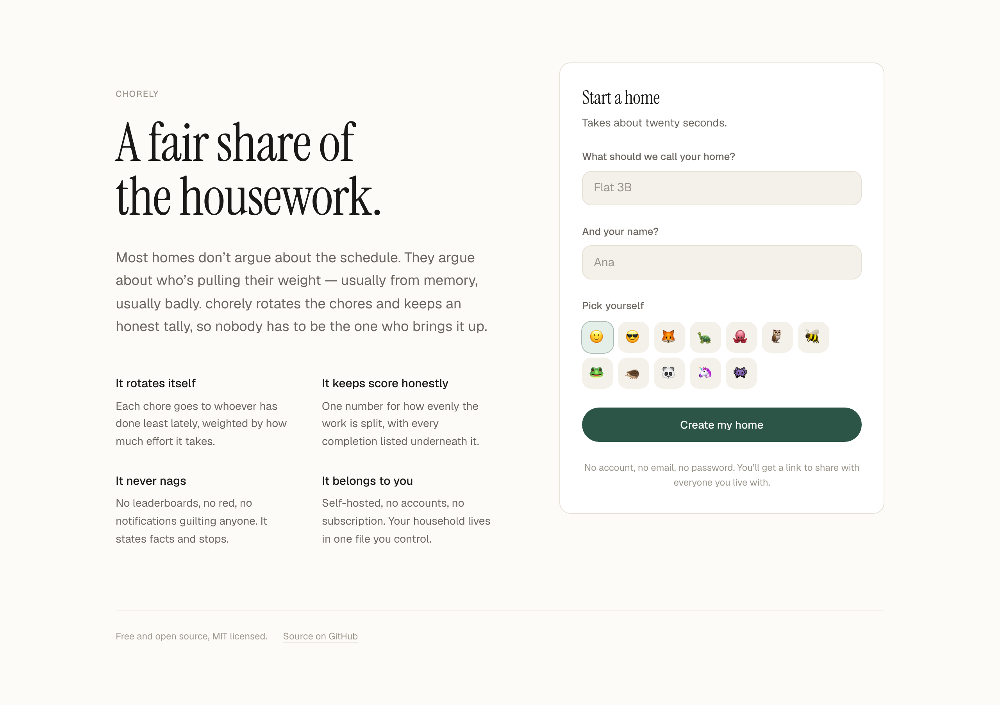
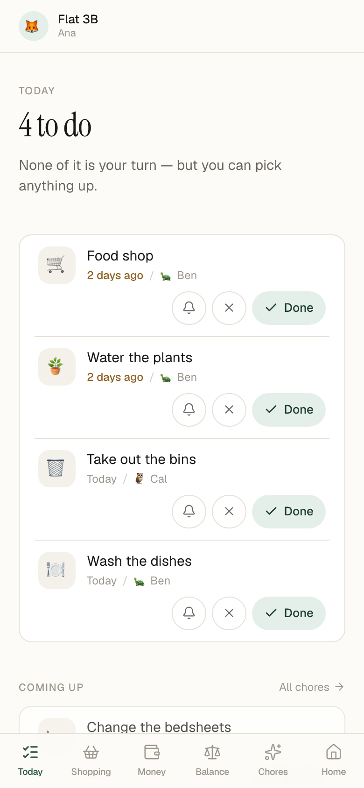
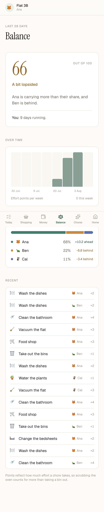
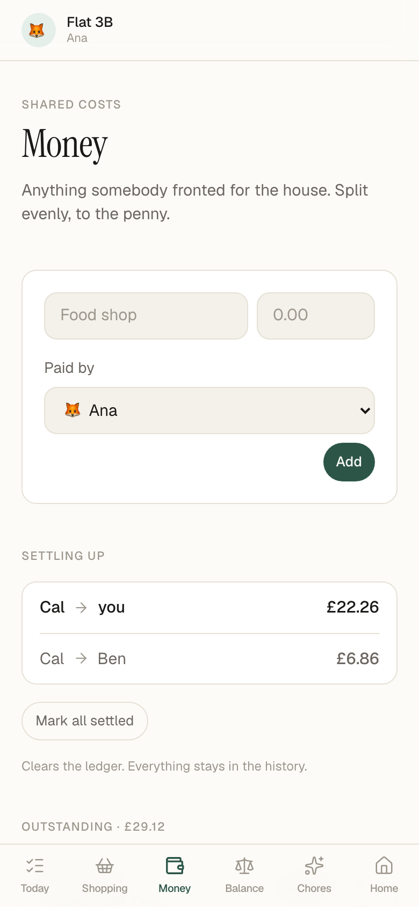

<div align="center">

# 🧹 chorely

**A fair share of the housework.**

Most homes don't argue about the schedule. They argue about who's pulling their weight.

[](https://github.com/BleakMidwinter90/chorely/actions/workflows/ci.yml)
[](LICENSE)

</div>

<p align="center">
  
</p>

---

chorely rotates your household's chores automatically and keeps an honest tally of who actually did them, so nobody has to rely on memory — or on being the person willing to bring it up.

It runs on your own machine, in one container, with your data in one file. No accounts, no subscription, no cloud.

<table>
<tr>
<td width="33%"></td>
<td width="33%"></td>
<td width="33%"></td>
</tr>
<tr>
<td align="center"><b>Today</b> — what needs doing</td>
<td align="center"><b>Balance</b> — who's pulling their weight</td>
<td align="center"><b>Money</b> — settling up</td>
</tr>
</table>

## Why this exists

Every chore app tracks *tasks*. That's the easy half, and it's not the half that causes arguments.

The hard half is that two people can live in the same house, both genuinely believe they do most of the work, and both be arguing from memory. Memory is biased toward the effort you personally spent. A shared list doesn't fix that — it just becomes another thing nobody looks at.

So chorely's central feature isn't a checklist. It's a **balance score**: one number, 0 to 100, showing how evenly the work has actually been split, with the receipts sitting underneath it.

## What it does

**Assigns chores by itself.** Each chore goes to whoever has done the least lately, weighted by how much effort each job takes. Scrubbing the oven counts for more than taking a bin out. You can also set strict turn-taking, a fixed owner, or leave it open to anyone.

**Knows the difference between flexible and fixed.** Cleaning the shower is due seven days after you *last cleaned it* — do it late and the next one moves with it. The bins go out every Tuesday whether or not last week happened. Most chore apps collapse these two into one setting and get one of them wrong.

**Doesn't pile up guilt.** Miss a fixed chore for two months and you have one thing to do, not eight. An app that greets you with a wall of red gets deleted.

**Lets "fair" mean what you agreed it means.** Someone works nights, travels, or the house has simply agreed they do less? Give them a smaller share and the balance expects that instead. Fairness is declared up front rather than relitigated every week.

**Never becomes a weapon.** There's no leaderboard, nothing red, and no nagging. Late chores say "3 days ago", not **OVERDUE**. The balance summary names an imbalance without naming a villain — there's a test that asserts it.

## Install it like an app

chorely is a progressive web app. Open it on a phone and add it to the home
screen — it launches without a browser bar, keeps working when the signal
drops, and can send reminders.

- **Android / Chrome** — an install banner appears on the Home screen inside
  the app.
- **iPhone / Safari** — tap Share, then Add to Home Screen.

Installing requires HTTPS, which browsers insist on for service workers. Over
plain HTTP on a home network everything still works; you just don't get the
offline shell.

## Getting started

### Docker (recommended)

```bash
git clone https://github.com/BleakMidwinter90/chorely.git
cd chorely
docker compose up -d
```

Open <http://localhost:3000>, create your home, and share the invite link with everyone you live with.

That's the whole setup. No database to provision, no environment variables, no migration command — migrations run themselves on first start, including after an upgrade.

### Local development

```bash
npm install
npm run dev
```

| Command | What it does |
| --- | --- |
| `npm run dev` | Development server on port 3000 |
| `npm run build` | Production build |
| `npm test` | Run the test suite |
| `npm run test:coverage` | Tests with a coverage report |
| `npm run typecheck` | TypeScript, no emit |
| `node scripts/demo-seed.mjs` | Fill a demo household with realistic data |
| `node scripts/screenshots.mjs` | Re-render the README screenshots |

## How the balance score works

Each member has an agreed **share** — equal by default. Over a rolling window (28 days out of the box), chorely adds up the effort points each person actually earned and compares that to the share they signed up for.

The score is total deviation from the ideal split, divided by the worst deviation *possible* for a household that size, inverted onto 0–100.

That normalisation is the part that matters. It makes the number mean the same thing regardless of how many people live there:

| Situation | Score |
| --- | --- |
| Perfectly even split | 100 |
| A 60/40 split | 80 |
| One person did everything (2 people) | 0 |
| One person did everything (6 people) | 0 |

Without normalising against household size, that last pair would score 50 and 83 — which would quietly tell a six-person house that one person doing *all* the work is a passable result.

Some deliberate choices in the ledger:

- **Effort is frozen at the moment a chore is completed.** Re-pricing "clean the oven" from 5 points to 2 can't retroactively rewrite who was pulling their weight last month.
- **Credit goes to whoever actually did the work**, not whoever it was assigned to. Doing someone else's turn is a kindness and should count as one.
- **Skipping is its own action.** If the house ate out all week, the kitchen chore can be dismissed without either pretending it was done or leaving it to rot.
- **Removing a chore or a person archives them.** Deleting would silently rewrite history.

## Security model, stated plainly

There are no user accounts. You create a household, get a link, and the people you live with open it and type their name — that device is then them.

**Anyone holding the invite link can join the household and see its chores.** That's the same trust model as a shared calendar link, and it's the right one for "who cleaned the bathroom".

This is a deliberate trade. The cost of an account system is paid by the least technical person in the house, and it's usually paid by them never signing up at all — which is how a shared app ends up with one user.

Session cookies contain a random token; only its SHA-256 hash is stored, so a leaked database file doesn't hand over live sessions.

If you expose chorely to the public internet, put it behind HTTPS.

## Shared costs

Anything somebody fronted for the house — the shop, a bill, a new kettle. Split
evenly to the penny, and chorely works out the shortest set of payments that
clears everyone.

Amounts are stored as integer pence. Money in floating point is a well-known way
to end up a penny out and unable to explain why, and being unable to explain why
is fatal for a feature whose whole job is settling an argument about money.

Settled expenses stay in the ledger as history rather than being deleted —
"what did we spend last month" is a question people ask.

## Going away

Tell chorely you're away for a weekend, a week, a fortnight or a month, and two
things happen. Your chores get handed to whoever is around — and your **expected
share shrinks in proportion to the days you were gone**.

That second half is the one that matters. Pausing assignment alone would leave
you coming home from a fortnight away to an app announcing you were behind,
which would be both false and exactly the accusation this project exists not to
make.

## The shared shopping list

Chores and groceries are the two things every shared household actually
coordinates, and keeping them in one place is what stops the list drifting back
into a group chat where nothing can be ticked off.

Add anything the house runs out of; everyone sees the same list. Ticking an item
moves it to the trolley rather than deleting it, because mid-shop *"what have I
already picked up"* is the question the list is really being asked. Items bought
over a week ago tidy themselves away — nobody is ever going to press "clear" as
a task in its own right.

## Reminders

Each person can ask for one notification a day, at an hour they choose, and
only when something is actually on their list. Turn it on under **Home →
Reminders**.

Some deliberate limits:

- **At most one a day, per person.** An app that sends two notifications about
  the same bin gets its notifications switched off, and then it may as well not
  have them.
- **Never about an empty list.** No "well done, nothing to do".
- **It states the fact and stops.** No exclamation marks, no counting how many
  days something has slipped. There is a test asserting the wording never
  scolds.

chorely runs its own timer, so there is nothing to schedule. VAPID keys are
generated on first use and stored with your data — no key-generation command to
run before notifications work.

If you run several replicas, disable the in-process timer with
`CHORELY_DISABLE_SCHEDULER=1` and drive it yourself instead:

```bash
curl -X POST https://your-instance/api/cron/reminders
```

That endpoint is safe to call as often as you like — the once-a-day rule means
extra calls do nothing. Set `CRON_SECRET` to require a bearer token.

Notifications require HTTPS, since browsers only allow service workers in a
secure context. On a home network over plain HTTP everything else works; you
just don't get reminders.

## API and data export

Everything the app does is available over HTTP, so you can wire chorely into a
wall tablet, an NFC tag, Home Assistant, or anything else you fancy.

Create a token under **Home → Your data**. It covers one household and is shown
exactly once — only a SHA-256 hash is stored, so there is genuinely no way to
show it again.

```bash
TOKEN=chorely_xxxxxxxxxxxx

# What needs doing
curl -H "Authorization: Bearer $TOKEN" https://your-instance/api/v1/agenda

# The balance score and per-person load
curl -H "Authorization: Bearer $TOKEN" https://your-instance/api/v1/balance

# Tick something off — a token identifies a household, not a person,
# so the ledger needs to know who to credit
curl -X POST -H "Authorization: Bearer $TOKEN" \
     -H "Content-Type: application/json" \
     -d '{"action":"complete","memberId":"mb_..."}' \
     https://your-instance/api/v1/occurrences/oc_...

# Everything you have, as one file
curl -H "Authorization: Bearer $TOKEN" https://your-instance/api/v1/export -o chorely.json
```

The same endpoints accept your ordinary session cookie, so the browser needs no
second credential.

The export deliberately leaves out secrets — the join code, session tokens, API
token hashes and push subscriptions are credentials rather than content, and an
export is a file people email to themselves.

## Configuration

| Variable | Default | Purpose |
| --- | --- | --- |
| `DATABASE_URL` | `file:./data/chorely.db` | SQLite file path, or a Turso URL for a hosted deployment |
| `DATABASE_AUTH_TOKEN` | — | Turso auth token; ignored for local files |
| `PORT` | `3000` | Port to listen on |
| `COOKIE_SECURE` | auto | Force the session cookie's `Secure` flag on (`1`) or off (`0`) |
| `CHORELY_DISABLE_SCHEDULER` | — | Set to `1` to turn off the built-in reminder timer |
| `CRON_SECRET` | — | Require this bearer token on `/api/cron/reminders` |
| `VAPID_PUBLIC_KEY` / `VAPID_PRIVATE_KEY` | auto | Bring your own push keys instead of generated ones |
| `VAPID_SUBJECT` | `mailto:chorely@localhost` | Contact address sent to push services |

By default the `Secure` flag follows the actual protocol of the request, read from `x-forwarded-proto`. That means it works out of the box both on a home network over plain HTTP and behind an HTTPS reverse proxy. Set `COOKIE_SECURE=1` only if your proxy terminates TLS without setting that header.

### Trying it with demo data

An empty app doesn't show what the balance score is for. To populate a three-person share house with a few weeks of deliberately uneven history:

```bash
node scripts/demo-seed.mjs
```

Safe to re-run — it clears the demo household first. Don't point it at a database you care about.

### Backups

Everything is in one SQLite file. Copy `data/chorely.db` and you have backed up the entire household.

## How it's built

- **Next.js 16** (App Router, React 19, Turbopack) with Server Actions
- **SQLite via libSQL** — a local file when self-hosted, [Turso](https://turso.tech) when hosted, one driver either way
- **Drizzle ORM** with migrations that apply themselves at startup
- **Tailwind CSS 4**
- **Vitest** — 112 tests, 98% coverage on the rules engine

The scheduling, rotation and fairness rules live in [`lib/domain/`](lib/domain/) as pure, dependency-free functions. No database, no framework, no clock — callers pass `today` in explicitly. That's what makes the rules exhaustively testable, and these are the rules users will argue with, so they need to be.

Dates are handled as `YYYY-MM-DD` strings with UTC-midnight internals, so daylight saving can't quietly make a chore come due a day early twice a year.

## Contributing

Issues and pull requests are welcome.

If you're changing anything in `lib/domain/`, it needs tests — that's the layer households will disagree with, and it should be able to defend itself.

```bash
npm test          # must pass
npx eslint .      # must be clean
npx tsc --noEmit  # must be clean
```

## License

[MIT](LICENSE).
